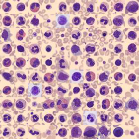

# DATASCI 223 Final Project

Jennifer Zhu and Muyun Tsen

## Introduction

The goal of our project is to classify images of blood cell types using the BloodMNIST dataset from MedMNIST, sourced from Acevedo et al. (2020), using various machine learning methods. For this analysis, we will explore how a random forest model compares to a convolutional neural network in correctly classifying the eight blood cell types. 

The BloodMNIST dataset contains 11,959 training and 3,421 testing preprocessed images of eight different blood cell types from under a microscope. Each image has three channels and the class distribution can be found in Table 1.

### Sample images from BloodMNIST 

**Table 1.** Blood cell type class distribution
| Class ID | Class Name              | Count   | Percentage    |
|----------|-------------------------|---------|---------------|
| 0        | Basophil                | 852     | 7.12          |
| 1        | Eosinophil              | 2181    | 18.24         |
| 2        | Erythroblast            | 1085    | 9.07          |
| 3        | Immature Granulocytes   | 2026    | 16.94         |
| 4        | Lymphocyte              | 849     | 7.10          |
| 5        | Monocyte                | 993     | 8.30          |
| 6        | Neutrophil              | 2330    | 19.48         |
| 7        | Platelet                | 1643    | 13.74         |

## Methods
We began by using a random forest model to classify the blood cell types. For this model, the images had to first be compressed and converted into numpy arrays before being input. With the `RandomForestClassifier` function from `scikit-learn`, we are able to train the model on the training dataset using 100 trees. We chose to include 100 trees as an attempt to use sufficient trees while maintaining efficiency in modeling the data. 

We also applying a convolutional neural network (CNN) implemented in PyTorch for image classification across 8 blood cell types. Preprocessing involved converting images to tensors and normalizing pixel values. The CNN architecture consisted of two convolutional layers with ReLU activations and max pooling, followed by two fully connected layers. We trained the model using the Adam optimizer and weighted cross-entropy loss to address class imbalance. Evaluation was based on accuracy, one-vs-rest AUC, and precision/recall/F1 metrics using `scikit-learn`. 

To reduce training complexity and time, we used a compact CNN with only two convolutional layers instead of deeper architectures. While this speeds up training and reduces overfitting risk, it may limit model capacity to capture more complex spatial patterns. Class weights were included to mitigate imbalance. However, we avoided heavy data augmentation to preserve label clarity and limit processing overhead.
The following packages are installed: torch, torchvision, scikit-learn, matplotlib, pandas, medmnist, and tqdm. Run the script in a Python environment. The model will automatically download the dataset, train on the training set, and print evaluation metrics on the test set.

## Results
From our random forest model, we found that this model performed moderately well in classifying the eight blood cell types. The overall and class-specific precision, recall, and AUC can be found in Table 2. If we compare our results from the convolutional neural network, we note that although the random forest works well, the convolutional neural network outperforms the random forest in every evaluation metric. This is expected as the random forest model we used was quite simple and since CNNs are better suited for image classification in general. Additionally, no class imbalance was corrected for in the random forest.   

For the CNN model, we found that this model also performed well. The overall and class-specific precision, recall, and AUC can be found in Table 3. The CNN model achieved a test accuracy of 90.1%, indicating strong overall predictive performance. Class-wise AUC values were consistently high across all 8 blood cell types, with several classes achieving near-perfect scores. The classification report further confirms robust generalization, with macro-averaged precision, recall, and F1-scores all above 0.88. Performance was especially strong for dominant classes like neutrophils and platelets, but even rarer classes like eosinophils and erythroblasts were accurately identified with F1-scores above 0.80. This output demonstrates the model's ability to reliably classify diverse blood cell types based on image data. 

**Table 2.** Evaluation metrics for the random forest model by class
| **Random Forest** |            |         |        |
|-------------------|------------|---------|--------|
| Class ID          | Precision  | Recall  | AUC    |
| 0                 | 0.7247     | 0.5287  | 0.9546 |
| 1                 | 0.8975     | 0.9263  | 0.9903 |
| 2                 | 0.8881     | 0.8167  | 0.9783 |
| 3                 | 0.6314     | 0.7841  | 0.9350 |
| 4                 | 0.8442     | 0.8025  | 0.9898 |
| 5                 | 0.8500     | 0.4789  | 0.9567 |
| 6                 | 0.8595     | 0.9459  | 0.9894 |
| 7                 | 0.9936     | 0.9936  | 0.9999 |
| Overall           | 0.8361     | 0.7846  | 0.9743 |

**Table 3.** Evaluation metrics for the convolutional neural network model by class
| Class ID | Precision  | Recall        | AUC           |
|----------|------------|---------------|---------------|
| 0        |0.7852      |0.8238         |0.9859         |
| 1        |0.9761      |0.9824         |0.9992         |
| 2        |0.9209      |0.9357         |0.9944         |
| 3        |0.7282      |0.8791         |0.9715         |
| 4        |0.8838      |0.8765         |0.9954         |
| 5        |0.9231      |0.6338         |0.9871         |
| 6        |0.9854      |0.9114         |0.9968         |
| 7        |0.9979      |0.9979         |1.0000         |
| Overall  |0.9093      |0.9012         |0.9913         |

## Discussion

A key challenge in this task was managing class imbalance within the BloodMNIST dataset, which includes both common and rare blood cell types. Initial models without class weighing showed strong performance on majority classes but poor recall on underrepresented ones. To address this, we integrated class-weighted cross-entropy loss, which significantly improved F1-scores for minority classes. Another issue was selecting a model architecture that balanced complexity and performance. Deeper CNNs were considered, but ultimately, a two-layer CNN with optimized training provided high accuracy with efficient training time. Through systematic testing and evaluation, we arrived at a model that generalized well while being computationally efficient.

## References

Andrea Acevedo, Anna Merino, Santiago Alférez, Ángel Molina, Laura Boldú, José Rodellar,
A dataset of microscopic peripheral blood cell images for development of automatic recognition systems, Data in Brief, Volume 30, 2020, 105474, ISSN 2352-3409,
https://doi.org/10.1016/j.dib.2020.105474.

Jiancheng Yang, Rui Shi, Donglai Wei, Zequan Liu, Lin Zhao, Bilian Ke, Hanspeter Pfister, Bingbing Ni. Yang, Jiancheng, et al. "MedMNIST v2-A large-scale lightweight benchmark for 2D and 3D biomedical image classification." Scientific Data, 2023.

Jiancheng Yang, Rui Shi, Bingbing Ni. "MedMNIST Classification Decathlon: A Lightweight AutoML
Benchmark for Medical Image Analysis". IEEE 18th International Symposium on Biomedical Imaging (ISBI), 2021.
